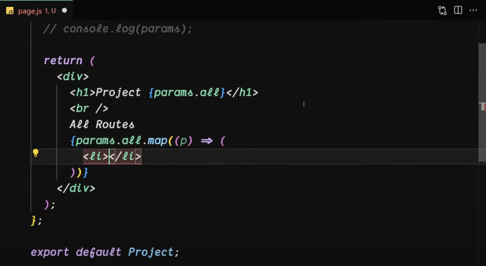
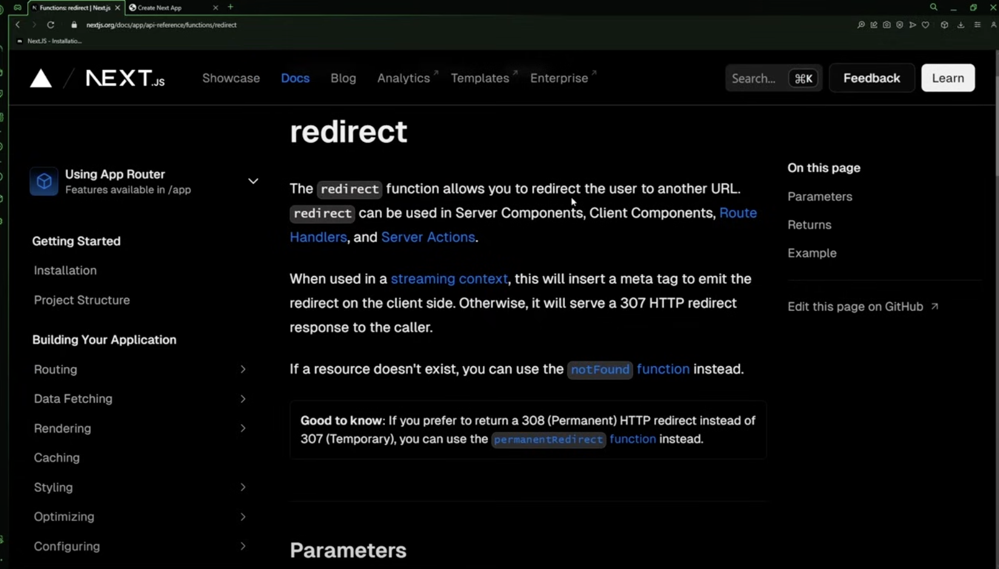
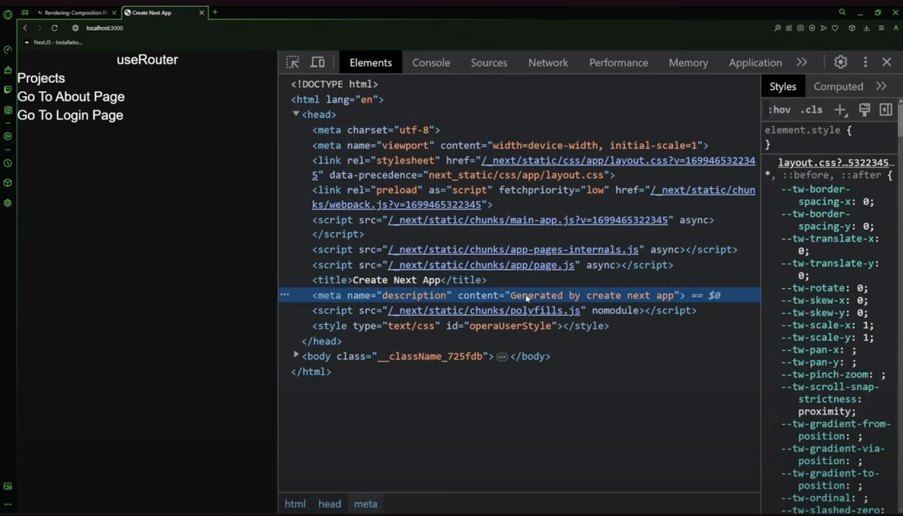

- Folder structure:
  - when you run `npm run dev` or `npm run build` the project is build and stored in the `.next` dir.
  - `app`: heart of the app
  - `next.config.js`: providing domains, redirects,

# Routing in NextJS


# Link in NextJS


- When you create a client side component, store it in the `project/components` folder outside `app`
- `import Link from 'next/link'`, not from 'next/navigation' that is deprecated
- `<Link href='/'> Home </Link>

# `useRouter()` hoook in NextJS


- its a hook that allows us to do the same thing as Link but it gives us more control on navigation

- `import { useRouter } from 'next/navigation'`;

## First way to use `useRouter()`


## another way, same thing but better


# ⭐️ Difference between `Link` and `useRouter()`

- Link is a component, whereas useRouter is a hook, both are provided by NextJS, next/link and next/navigation.

## side note:

if you want to store a bunch of pages together inside a folder but dont want the folder name to become part of the path, simply wrap the parent folder's name in `()`, for example:

- consider you have a login folder with a `page.ts` and a register folder with `page.ts`, you move both these folders inside a new folder inside app called `(auth)` instead of `auth`, this lets you access login directly using `/login` instead of `/auth/login`.

# Dynamic Routes in NextJS


## example:


# Catch-All Routes


## example:


> here `users`, `alex`, `projects`, etc are considered url segments

## code example:

- consider a folder called `projects` with a catch all route `[...all]` inside this we have `page.ts`, so the folder structure is:
  `app/projects/[...all]/page.ts` which looks like this:




> output:


# Custom `404 Not Found` page:

- inside app make this file with the same name: `not-found.jsx` and define your fallback logic in it.

# Redirects in NextjS




- example from docs for server comp:
  

- example:
  
  ⭐ Note the double equal to instead of `===`

# Server Components and Client Components

## Server Components

> ## benefits:

- Data Fetching
  - move data fetching to the server, closer to the data source, reducing the number of requests the client needs to make, increasign performance.
- Security:
  - no need to expose secrets and API keys to client.
- Caching:
  - data can be cached on the server
- Reduced bundle size:
  - we can keep dependencies on the server that previously would impact the client JS bundle size on the server
  - this is beneficial for users with slow internet or slow devices (less powerful js engine execution)
  - as the client does not have to download parse and execute any JS for server components.
- SEO and Social Shareability:
- Time reduction to Initial Page Load & First Contentful Paint (FCP)

## Client components:

- Client Components allows you to write <span style="color:red;">interactive</span> UI that can be rendered on the client at <span style="color:red;">request time</span>.
  


> ## benefits:

- interactivity
- browser apis

## when to use which:


# Layout in NextJS


## `usePathname()` hook:


## Imporving SEO: `export const metadata = {...}`


> output:
> 

This is how to do it inside the Layout file, you can also provide metadata specific to any page:

output:


# use the `<Image src={}/>` tag (or component) for optimized compressed image renders:


- when you use the Image tag, according to the width and height and maybe other factors, nextjs automatically compresses the image file without losing quality, if you just use the traditional img tag the size is not changed, in this example the original image was 6.7 MB and it got reduced to 130KB
- to work with internet URLs instead of local files, you need to configure their domains in the `next.config.js` file like so:
  
  then in the code you can do:
  
  otherwise you'll get error

# using fonts in next js: see later

# fetching data using a third party api in a Client Component

> EZ
> 

# fetching data using a third party api in a Server Component


- Note that the output of the console log in this server component is not visible in the browser's console, instead in the vsc console

# Backend in NextJS

- In Next.js, you can create serverless API routes inside the pages/api directory. Each file in this directory maps to a route. For example, pages/api/hello.js becomes accessible at /api/hello.
- Next.js functions in pages/api are serverless by default when deployed on platforms like Vercel or Netlify. They are executed in a stateless environment, spun up when needed and torn down afterward.
- Express Comparison: Express typically runs on a long-running server (Node.js) where state can persist across requests
- Advantage: Serverless architecture in Next.js simplifies scaling because each function runs independently without maintaining server infrastructure.

## Basic Points related to GET, POST, etc methods

- route.ts or route.js only
- In Next.js, you don't use `req` and `res` (as in Express). Instead, Next.js uses the native web API objects, `Request` and `Response`, similar to the Fetch API.
- Next.js also introduces `NextResponse`, which is an extended version of the `Response` object. It adds Next.js-specific features for handling redirections, cookies, etc.
  - `NextResponse.redirect()`: For handling redirections.
  - `NextResponse.json()`: For sending a JSON response.

## - ⭐ GET Function Parameters

- In Next.js, when you define API routes using the App Router, the exported functions for handling HTTP requests (like `GET`, `POST`, `DELETE`, etc.) can take up to two parameters: `request` and `context`.

  - `request`: The `request` object in Next.js is based on the native web API `Request` interface, which is quite different from Express's `req` object. Here's a breakdown of its key properties:

    - `method`: Like in Express, it contains the HTTP method (GET, POST, etc.).
    - `url`: The full URL of the request.
    - `headers`: A Headers object that contains the request headers.
    - `body`: Represents the body of the request. To access the body (in a POST or PATCH request), you typically need to use methods like request.json() or request.text() depending on the content type.
    - `query` and `params`: You won't find a query or params property on the request object directly, but they are often available through the context object (more on this below).

  - `context`: This contains additional information, like `params` & `searchParams` (for dynamic routes).
    - `params`: If you’re using dynamic routes (e.g., `/api/products/[id]`), you can access the URL parameters through `context.params`. This is the equivalent of `req.params` in Express.
    - `searchParams`: Only for dynamic routes. The query string (e.g., `/api/products?category=books`) is accessible via `context.searchParams`. 
    - Just use this for static routes
    ```js
    const url = new URL(req.url);
    const id = url.searchParams.get('id');
```

- setting status code: `return NextResponse.json({ message: 'Hello' }, { status: 200 });`
- setting cookie:

```js
import { NextResponse } from "next/server";

export async function GET() {
  const response = NextResponse.json({ message: "Hello" });
  response.cookies.set("token", "1234abc", { httpOnly: true, maxAge: 3600 });
  return response;
}
```

- getting cookie: Cookies sent by the client are available on the request object using `req.cookies.get('myCookieName');`, for example:
  `const jwtToken = req.cookies.get('Authorization');`

> example:

```js
export async function GET(request, { params }) {
  // Access request properties here (e.g., headers, URL, method)
  const method = request.method; // e.g., 'GET'
  const url = request.url; // Full URL of the request
  const headers = request.headers; // Headers object

  const productId = params.id;

  const response = NextResponse.json({ message: "Hello" }, { status: 201 });
  response.cookies.set("token", "1234abc", { httpOnly: true, maxAge: 3600 });
  return response;
}
```

- const body = await request.json();
- create an `api` folder in `app`
- create: `app/api/users/route.js`
- then simply export a function with a fixed set of names:
  
  route.js

```js
import { NextResponse } from "next/server";

export function GET() {
  return NextResponse.json(
    {
      result: "hello",
    },
    {
      status: 404,
    }
  );
}
```

## Dynamic Backend Routes

- create `app/api/users/[id]/route.js` for a dynamic id route.

route.js
Example: If you have a route file `app/products/[id]/route.js`:

```js
export async function GET(request, { params }) {
  const { id } = params;
  return NextResponse.json({ message: `Product ID is ${id}` });
}
```
## Middlewares

- create middleware.js in the root